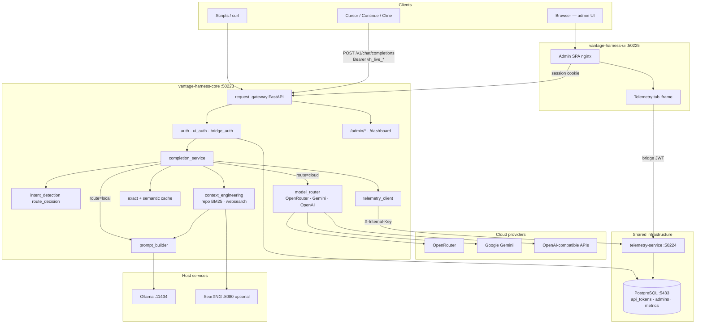
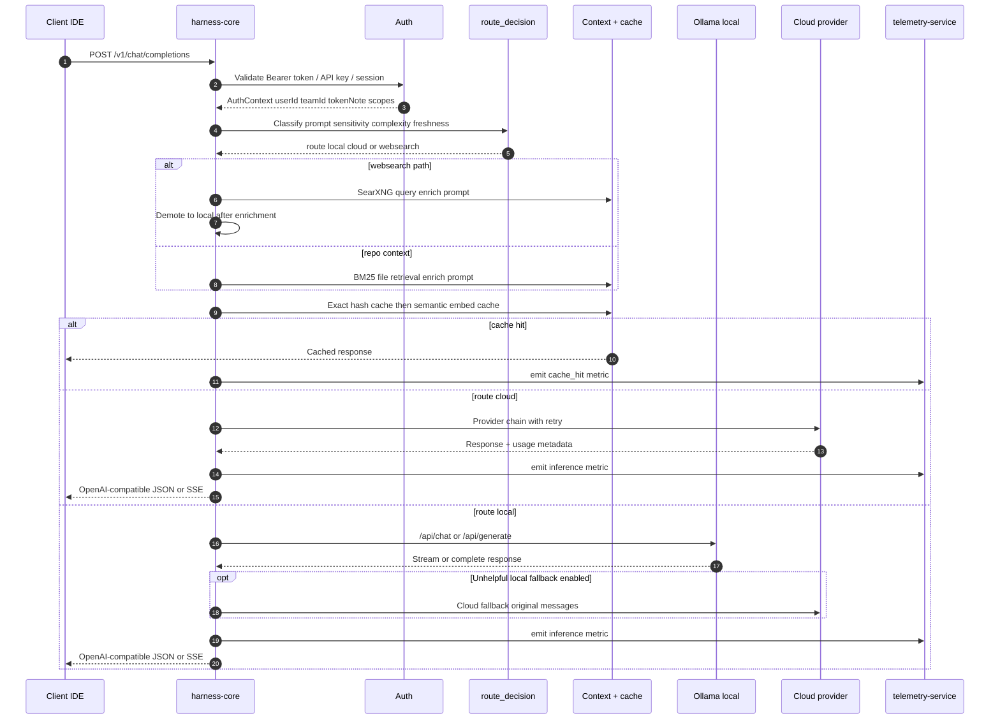
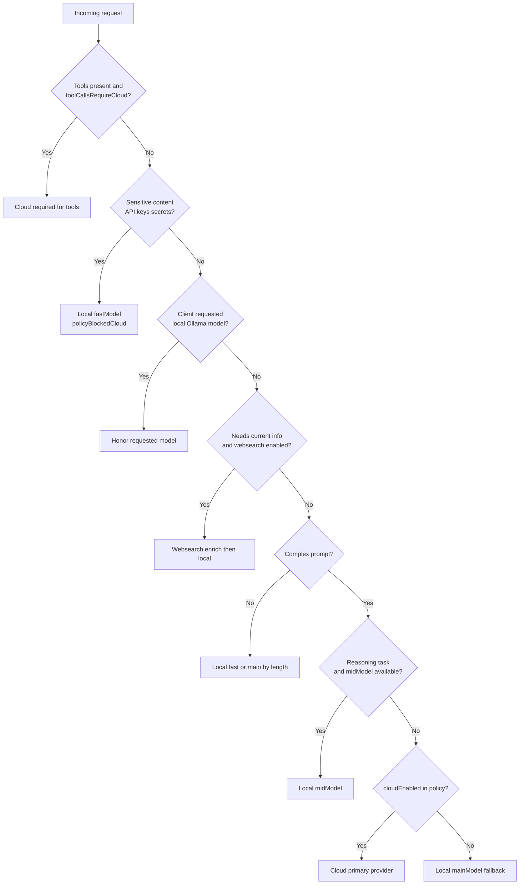
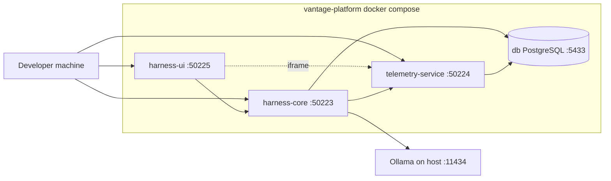

# Harness Architecture

The Vantage harness is an OpenAI-compatible gateway that routes IDE and CLI requests between **local Ollama** models and **cloud providers**, with policy enforcement, caching, repo context injection, and cost-aware observability.

This document describes the **harness split stack** (port **50223**). Telemetry collection and dashboards are documented separately in [TELEMETRY_ARCHITECTURE.md](./TELEMETRY_ARCHITECTURE.md).

---

## Repositories and roles

| Repository | Port | Role |
|------------|------|------|
| [vantage-harness-core](../vantage-harness-core) | **50223** | FastAPI gateway: routing, completions, auth, admin API |
| [vantage-harness-ui](../vantage-harness-ui) | **50225** | Admin SPA (nginx); embeds telemetry dashboard |
| [vantage-harness-db](../vantage-harness-db) | **5433** | PostgreSQL migrations (`api_tokens`, `admins`, `metrics`, …) |
| [vantage-platform](../vantage-platform) | — | Docker Compose orchestration |

**External dependencies (not in compose):**

- **Ollama** — `http://host.docker.internal:11434` (local LLM inference)
- **Cloud providers** — OpenRouter, Gemini, OpenAI (via API keys in env)
- **SearXNG** (optional) — web search for freshness queries (`config/vantage.config.json`)

The original monolith at `vantage-harness` on port **50123** remains unchanged during migration.

---

## Architecture diagram



---

## Request lifecycle

A typical `POST /v1/chat/completions` request flows through these stages:



---

## Routing engine

`route_decision()` in `intent_detection.py` chooses **local**, **cloud**, or **websearch** before any model call.



**Additional runtime gates in `completion_service`:**

| Condition | Effect |
|-----------|--------|
| Ollama health check failing | Auto-escalate to cloud when allowed |
| Repo context hits + `allowCloudContext: false` | Demote cloud → local |
| Policy blocks cloud | Local only; sensitive flag set on metric |
| Unhelpful local response + fallback enabled | Retry on cloud with **original** messages (no repo context leak) |

**Cloud provider chain:** primary provider from config (default OpenRouter) → `fallbackProviders` (e.g. Gemini) with configurable retry on 429/5xx.

---

## Key modules

| Module | Responsibility |
|--------|----------------|
| `request_gateway.py` | FastAPI app, `/v1/*` routes, CORS, health, static dashboard mount |
| `completion_service.py` | End-to-end request orchestration and metric emission |
| `intent_detection.py` | Routing classification |
| `model_router.py` | Cloud dispatch, provider fallback, mock mode |
| `prompt_builder.py` | Ollama payload construction, tier selection, client detection from headers |
| `context_engineering.py` | Repo BM25 retrieval, websearch enrichment, response sanitization |
| `context_cache.py` | Exact-match response cache (in-memory LRU; optional Redis) |
| `semantic_cache.py` | Embedding similarity cache via Ollama `nomic-embed-text` |
| `telemetry_client.py` | Async fire-and-forget metrics to telemetry-service |
| `auth.py` | API tokens, admin accounts, scope enforcement |
| `ui_auth.py` | Dashboard login, Google OAuth, telemetry bridge JWT issuance |
| `pricing.py` | Cost estimation for local vs cloud routing metrics |

### Configuration files (mounted in Docker)

| File | Purpose |
|------|---------|
| `config/vantage.config.json` | Ollama models/tiers, cache, cloud, repo, websearch, UI |
| `config/policy.json` | `cloudEnabled`, sensitive patterns, tool-call cloud requirement |
| `config/rules.json` | Complexity thresholds, unhelpful-response fallback rules |

---

## Authentication

| Mechanism | Used by | Notes |
|-----------|---------|-------|
| **User API tokens** (`vh_live_*`) | IDE clients | Stored hashed in PostgreSQL `api_tokens`; scoped (`inference`, `telemetry`) |
| **Legacy `VANTAGE_API_KEY`** | Dev / single-key setups | Env var on gateway |
| **UI session cookie** | Dashboard Playground | `vantage_session` httponly cookie |
| **Admin token / localhost** | `/admin/tokens`, config reload | `VANTAGE_ADMIN_TOKEN` or localhost-only |
| **Admin password / Google OAuth** | harness-ui login | Allowlist in config |
| **Telemetry bridge JWT** | Embedded telemetry iframe | Short-lived HMAC JWT from `POST /api/auth/telemetry-bridge` |
| **Internal key** | harness → telemetry-service | `TELEMETRY_INTERNAL_KEY` header |

When PostgreSQL is available or `VANTAGE_API_KEY` is set, inference requires valid credentials. Otherwise the gateway runs in dev-open mode.

**Client detection for metrics:** `detect_client_from_headers()` inspects User-Agent, `x-cursor-*` headers, `x-vantage-client`, and auth token notes to stamp `client` on inference events (Cursor, Continue, Codex, …).

---

## Caching

| Layer | Key | Skip when |
|-------|-----|-----------|
| **Exact (ResponseCache)** | SHA-256(model + messages) | Sensitive/policy-blocked, repo hits, websearch hits, tool calls |
| **Semantic (SemanticCache)** | Cosine similarity ≥ 0.92 on embeddings | Same exclusions |

Cache hits return immediately and emit zero-cost metrics with `reason: cache_hit` or `semantic_cache_hit`.

Defaults (from `vantage.config.json`): TTL 3600s, max 512 exact entries, max 200 semantic entries.

---

## Observability integration

The harness **does not** persist metrics locally in production. All inference telemetry flows to telemetry-service:

```
completion_service → telemetry_client.emit() → POST /v1/internal/events
```

| Field | Purpose |
|-------|---------|
| `route`, `model`, `reason` | Routing decision audit |
| `latencyMs`, `estimatedTokens` | Performance and usage |
| `estimatedAllCloudCostUsd`, `actualCostUsd` | Cost and savings |
| `client`, `tokenNote` | IDE attribution in Tool Usage dashboard |
| `repoContextHits`, `webSearchHits`, `fallbackUsed` | Context and escalation signals |

Failed deliveries append to `data/inference_outbox.jsonl` for retry.

**Deprecated:** `POST /v1/telemetry` on harness-core forwards to telemetry-service for backward compatibility.

---

## Harness UI

[vantage-harness-ui](../vantage-harness-ui) is an nginx-hosted SPA:

| Tab | Function |
|-----|----------|
| **Telemetry** | iframe → telemetry-service dashboard with bridge JWT |
| **Security / Design / Architecture** | Gateway config and policy editors (admin) |
| **Developers** | Token management |

Runtime config (`runtime-config.js`) sets `VANTAGE_HARNESS_URL` and `VANTAGE_TELEMETRY_URL` at container start.

**Embedded telemetry flow:**

1. User logs in to harness-ui → session cookie on harness-core
2. Telemetry tab calls `POST /api/auth/telemetry-bridge`
3. iframe loads `telemetry-service/dashboard?embed=1&bridge=<JWT>`

---

## Database schema (shared)

Applied via [vantage-harness-db](../vantage-harness-db) migrations:

| Table | Harness use | Telemetry use |
|-------|-------------|---------------|
| `api_tokens` | IDE authentication | — |
| `admins` | Dashboard admin login | — |
| `ui_sessions` | Session storage (`service` column) | — |
| `metrics` | — | All event storage (inference + MCP) |

Platform compose uses database **`vantage_migration`** for the split stack; production cutover uses **`vantage`**.

---

## Docker topology (platform compose)



**Service dependencies:**

- `harness-core` → PostgreSQL (healthy), telemetry-service (started)
- `telemetry-service` → PostgreSQL (healthy)
- `harness-ui` → harness-core, telemetry-service

---

## IDE configuration

Point OpenAI-compatible clients at the harness gateway:

| Setting | Value |
|---------|-------|
| Base URL | `http://localhost:50223/v1` |
| Model | Real Ollama model ID (e.g. `qwen3.5:9b`) |
| API key | `vh_live_*` token or `VANTAGE_API_KEY` |

MCP telemetry config (`~/.vantage/config.json`):

```json
{
  "harness_url": "http://localhost:50223",
  "telemetry_url": "http://localhost:50224",
  "api_key": "vh_live_..."
}
```

Label auth tokens with the IDE name in the **note** field (e.g. `"Cursor IDE - sandi"`) so gateway inference appears under the correct client in telemetry dashboards.

---

## Related documentation

- [TELEMETRY_ARCHITECTURE.md](./TELEMETRY_ARCHITECTURE.md) — MCP collectors, ingest, dashboards
- [../DOCKER.md](../DOCKER.md) — Docker deployment
- [../IMPLEMENTATION.md](../IMPLEMENTATION.md) — quick start and ports
- [../vantage-harness/docs/vantage_split_implementation_plan.md](../vantage-harness/docs/vantage_split_implementation_plan.md) — full migration plan
