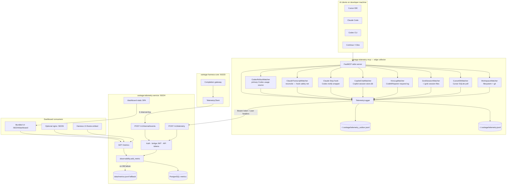

# Telemetry Architecture

Vantage telemetry collects developer and AI activity from local IDEs, enriches it with identity and privacy controls, persists it in a central store, and surfaces it through dashboards for adoption, cost, flow, and governance insights.

This document describes the **telemetry split stack**. The harness gateway (port 50223) is documented separately in [HARNESS_ARCHITECTURE.md](./HARNESS_ARCHITECTURE.md).

---

## Repositories and roles

| Repository | Port / transport | Role |
|------------|------------------|------|
| [vantage-telemetry-mcp](../vantage-telemetry-mcp) | stdio MCP | Edge collector: watchers, hooks, MCP tools. Self-contained one-command setup (`python setup.py`) |
| [vantage-telemetry-service](../vantage-telemetry-service) | **50224** | Ingest API, PostgreSQL storage, aggregation, bundled dashboard, dashboard auth (admin/user login, registration) |
| [vantage-telemetry-ui](../vantage-telemetry-ui) | **50226** (optional) | Standalone dashboard build. **Not** copied into telemetry-service automatically — `telemetry-service/static/` is a separately-maintained, hand-kept-in-sync copy of the same UI; a change to one does not propagate to the other |
| [vantage-harness-db](../vantage-harness-db) | **5433** | PostgreSQL migrations (`metrics` table shared with harness auth) |

**Design principle:** Only `telemetry-service` writes to the `metrics` table. The MCP server and harness-core are **producers**, not stores.

---

## Architecture diagram



---

## Data flow

### 1. Edge collection (MCP)

The MCP server runs inside the IDE (stdio transport) and starts background collectors on boot:

| Collector | Source | Event types |
|-----------|--------|-------------|
| **MCP tools** | Agent calls (`log_usage_analytics`, `log_audit_log`, …) | `usage`, `cost`, `audit`, `productivity`, GitHub PR events |
| **WorkspaceWatcher** | Filesystem events + git polling | `productivity`, `audit`, `session_outcome`, `file_*`, `coding_session_*` |
| **CursorDbWatcher** | `~/.cursor/ai-tracking/ai-code-tracking.db` (30s poll) | `cursor_usage`, `cursor_commit` |
| **Claude Code Stop hook** | Transcript JSONL token scan, fires per turn (push) | `usage` |
| **ClaudeTranscriptWatcher** | Same transcripts, 5min poll — reconcile safety net if the hook never fires (shares the hook's checkpoint, never double-counts) | `usage` |
| **Codex notify wrapper** | Turn-complete payload, fires per turn (push) | `agent_turn` — **no token data**, activity signal only |
| **CodexRolloutWatcher** | `~/.codex/sessions/**/rollout-*.jsonl` (30s poll) — the actual source of Codex token/cost numbers | `usage` |
| **GrokSessionWatcher** | `~/.grok/sessions/**/signals.json` (30s poll). Not an MCP host — only captured while the MCP is running for another tool | `usage` (context-token estimate, lower bound) |
| **KiroLogWatcher** | Kiro's CodeWhisperer request log, `q-client.log` (30s poll) | `agent_turn` — **no token data**, AWS SDK logs the streamed response as empty |
| **CopilotChatWatcher** | VS Code `github.copilot-chat/session-store.db` (30s poll) | `agent_turn` — **no token data**, GitHub meters usage server-side |

Claude Code and Codex are deliberately **both** push (hook/notify, real-time) **and** pull (watcher, periodic) — for Claude Code the watcher is a safety net behind an accurate hook; for Codex the watcher is the *primary* usage source since the notify hook never carried token counts at all. See [vantage-telemetry-mcp/README.md](../vantage-telemetry-mcp/README.md) for the full per-tool breakdown and setup.

Every event is wrapped in a **schema v1.0 envelope** before forwarding:

- **Identity:** `eventId`, `schemaVersion`, `type`, `occurredAt`, `userId`, `teamId`
- **Client context:** `client`, `clientOs`, `shellType`, `deviceId`, `sessionId`, `workspaceId`, `repoId`
- **Provenance:** `collectionMethod` (`mcp_tool`, `automatic`, `hook`, …)
- **Payload:** type-specific fields (tokens, lines, hash counts, etc.)

### 2. Durable local delivery

`TelemetryLogger` never relies on a single HTTP attempt:

1. Append to `~/.vantage/telemetry.jsonl` (local audit trail)
2. Append to `~/.vantage/telemetry_outbox.jsonl` (durable queue)
3. `POST` to `{telemetry_url}/v1/telemetry` (default `http://localhost:50224`)
4. On success → remove from outbox; on failure → exponential backoff retry

Hooks use `log_event_sync()` because hook processes are short-lived.

### 3. Central ingest (telemetry-service)

| Endpoint | Auth | Producer |
|----------|------|----------|
| `POST /v1/telemetry` | Bearer API token (or dev-open) | MCP server, external clients |
| `POST /v1/internal/events` | `X-Internal-Key` | harness-core inference metrics |

Ingest pipeline:

1. Validate envelope (schema version, required fields for PR events, etc.)
2. Enrich from auth context (`userId`, `teamId`, `tokenNote`, …)
3. Resolve stable `client` id (`cursor`, `claude-code`, `codex`, …)
4. Insert into PostgreSQL with idempotent `event_id` (`ON CONFLICT DO NOTHING`)
5. Fall back to `data/metrics.jsonl` if PostgreSQL is unavailable

### 4. Aggregation and dashboard

`GET /metrics` runs pure aggregation over stored events:

- **Inference:** routing (local/cloud), cost, savings, cache hits, latency
- **Client telemetry:** productivity sessions, audit trail, usage tokens
- **Cursor attribution:** hash-based AI code attribution (with token/duration estimates)
- **Rollups:** by tool (client), by model, by team, by user, PR lifecycle
- **Raw Events tab:** last 100 persisted events with token and duration columns

Dashboard deployment modes:

| Mode | URL | Notes |
|------|-----|-------|
| **Bundled (default)** | `http://localhost:50224/dashboard` | Static assets baked into telemetry-service |
| **Standalone nginx** | `http://localhost:50226` | `docker compose --profile standalone-ui` |
| **Embedded in Harness UI** | iframe with `?embed=1&bridge=<jwt>` | Cross-origin bridge JWT from harness-core |

---

## Client identification

The dashboard **Tool Usage** table shows **AI client identity** (Cursor, Codex, Claude Code, …), not individual MCP tool names.

Resolution order (server-side `_resolve_client_id`):

1. Explicit `client` field on the event (normalized)
2. Auth `tokenNote` / `authNote` (e.g. `"Cursor IDE - dev token"`)
3. Event-type fallbacks (`cursor_usage` → `cursor`; `agent_turn` no longer implies a single client — Codex, Kiro, and Copilot all emit it, so the explicit `client` field is authoritative here, not the event type)
4. Generic `api` client reclassified via token note when present

On the MCP edge:

1. MCP handshake `clientInfo.name` → `normalize_client_name()`
2. `VANTAGE_CLIENT` environment variable (overrides unknown handshake)
3. Hardcoded source for watchers (`cursor` for Cursor DB events)

---

## Dashboard access: registration and admin approval

Dashboard login (`/dashboard`) is separate from telemetry ingest auth (API tokens, bridge JWT) — it gates who can *view* the dashboards, via an **admin** role (username/password, full access) or a restricted **user** role (personal activity/usage only, via Google Sign-In or email).

A `users` table (`telemetry-service`, auto-created alongside `admins`/`api_tokens`/`ui_sessions`) backs self-service registration for the user role:

1. An unrecognized email attempting to log in gets a distinguishable `not_registered` response instead of a dead-end 403; the login page surfaces a **Request access** form (`POST /api/auth/register`).
2. Registration creates a `pending` row — it grants no access by itself.
3. An admin reviews pending requests on the dashboard's **Access Requests** tab (`GET /api/auth/admin/pending-users`, approve/reject endpoints under `/api/auth/admin/users/{email}/...`) and approves or rejects.
4. Only an `approved` email (or one already listed in `telemetry.config.json`'s `allowedEmails` — kept as a bootstrap allowlist, checked alongside the DB) can complete login.

Re-registering after a rejection resets the row back to `pending` rather than permanently locking the email out. This flow only ever grants the restricted user role — it cannot create an admin account.

---

## Storage model

### PostgreSQL (primary)

```sql
metrics (
  id          BIGSERIAL PRIMARY KEY,
  event_id    TEXT UNIQUE,          -- idempotency across MCP retries
  type        TEXT NOT NULL,
  timestamp   TIMESTAMPTZ NOT NULL,
  user_id     TEXT,
  team_id     TEXT,
  route       TEXT,                 -- inference: local | cloud
  payload     JSONB NOT NULL        -- all other event fields
)
```

Indexes support filtering by user, team, type, route, and time range.

### JSONL fallback

`vantage-telemetry-service/data/metrics.jsonl` — append-only fallback when DB insert fails. Used by legacy tests and offline dev.

### Client-side local files

| Path | Purpose |
|------|---------|
| `~/.vantage/config.json` | `telemetry_url`, `user_id`, `team_id`, `api_key`, workspace dirs |
| `~/.vantage/telemetry.jsonl` | Local event log |
| `~/.vantage/telemetry_outbox.jsonl` | Durable delivery queue |
| `~/.vantage/telemetry_delivery.log` | One line per delivery attempt (`OK`/`TIMEOUT`/`CONN`/`FAIL400`/…) |
| `~/.vantage/telemetry_dead_letter.jsonl` | Events the service permanently rejected (HTTP 400) |
| `~/.vantage/telemetry_delivered_ids.json` | Dedup ledger for the reconcile pass |
| `~/.vantage/cursor_watcher_state.json` | Cursor poll checkpoint |
| `~/.vantage/grok_watcher_state.json` | Grok poll checkpoint |
| `~/.vantage/copilot_watcher_state.json` | Copilot Chat poll checkpoint |
| `~/.vantage/kiro_watcher_state.json` | Kiro log-tail byte offsets |
| `~/.vantage/claude_stop_offsets/<session>.json` | Claude transcript checkpoint — shared by the Stop hook and the reconcile watcher |
| `~/.vantage/codex_rollout_offsets/<rollout>.json` | Codex rollout-file checkpoint, keyed per file |

---

## Event types reference

### Client telemetry (MCP / watchers / hooks)

| Type | Typical source | Key fields |
|------|----------------|------------|
| `usage` | MCP tool, Claude Stop hook/reconcile watcher, CodexRolloutWatcher, GrokSessionWatcher | `model`, `promptTokens`, `completionTokens`, `durationMs` — Grok's is a lower-bound context-token estimate (`tokenEstimateSource`), not exact |
| `cost` | MCP tool | `route`, `estimatedCostUsd`, `actualCostUsd`, `savingsUsd` |
| `productivity` | WorkspaceWatcher | `activeCodingTimeSec`, `linesAdded`, `reworkLines` |
| `audit` | Watcher, MCP | `action`, `target`, `status` |
| `cursor_usage` | Cursor DB watcher | `hashCount`, `estimatedTokens`, `durationMs`, `source`, `model` |
| `cursor_commit` | Cursor DB watcher | AI vs human line attribution per commit |
| `agent_turn` | Codex notify wrapper, KiroLogWatcher, CopilotChatWatcher | `turnType`/conversation metadata, message length — **no token/cost data on any of these three sources**; treat as activity, not spend |
| `session_outcome` | WorkspaceWatcher | `outcome`, `commitHash` |
| `pr_*` | MCP GitHub tools | PR lifecycle correlation fields |

### Gateway inference (harness-core via internal API)

| Type | Key fields |
|------|------------|
| `inference` | `route`, `model`, `latencyMs`, `estimatedTokens`, cost fields, cache/repo hits |
| `search_performed` | `query`, `provider`, `resultCount`, `latencyMs` |

---

## Privacy and data quality

- **Redaction:** secret patterns stripped; absolute paths truncated relative to workspace
- **Attribution confidence:** filesystem-only activity marked low confidence; IDE-specific sources (Cursor DB, hooks) carry higher confidence
- **Idempotency:** `eventId` prevents duplicate rows on MCP retry
- **Versioning:** `schemaVersion: "1.0"` tracked in Data Quality dashboard tab

---

## Configuration

### MCP client (`~/.vantage/config.json`)

```json
{
  "telemetry_url": "http://localhost:50224",
  "harness_url": "http://localhost:50223",
  "user_id": "developer@example.com",
  "team_id": "platform",
  "api_key": "vh_live_..."
}
```

### Useful environment variables

| Variable | Component | Purpose |
|----------|-----------|---------|
| `VANTAGE_CLIENT` | MCP | Default client id when handshake is unknown |
| `VANTAGE_FORWARD_TIMEOUT_SEC` | MCP | HTTP POST timeout to telemetry-service (default **10**) |
| `VANTAGE_OUTBOX_POLL_SEC` | MCP | How often the worker retries the durable outbox (default **15**) |
| `VANTAGE_RECONCILE_INTERVAL_SEC` | MCP | How often to replay undelivered events from local log (default **300**) |
| `VANTAGE_RECONCILE_TAIL_LINES` | MCP | Max tail lines scanned during reconcile (default **2000**) |
| `VANTAGE_RETRY_MIN_SECONDS` | MCP | Minimum backoff between delivery retries (default **5**) |
| `VANTAGE_CURSOR_POLL_INTERVAL_SEC` | MCP | Cursor DB poll interval |
| `VANTAGE_CURSOR_USAGE_INTERVAL_SEC` | MCP | Debounce between `cursor_usage` POSTs per Composer request |
| `VANTAGE_CURSOR_TOKENS_PER_HASH` | MCP | Token estimate multiplier for `cursor_usage` |
| `VANTAGE_GROK_POLL_INTERVAL_SEC` | MCP | GrokSessionWatcher poll interval (default **30**) |
| `VANTAGE_COPILOT_POLL_INTERVAL_SEC` | MCP | CopilotChatWatcher poll interval (default **30**) |
| `VANTAGE_KIRO_POLL_INTERVAL_SEC` | MCP | KiroLogWatcher poll interval (default **30**) |
| `VANTAGE_CODEX_POLL_INTERVAL_SEC` | MCP | CodexRolloutWatcher poll interval (default **30**) |
| `VANTAGE_CLAUDE_RECONCILE_INTERVAL_SEC` | MCP | ClaudeTranscriptWatcher poll interval — the Stop hook safety net (default **300**) |
| `VANTAGE_CLAUDE_RECONCILE_DEBOUNCE_SEC` | MCP | Skip transcripts written to more recently than this, so the reconcile watcher never races a live Stop hook (default **60**) |
| `DATABASE_URL` | telemetry-service | PostgreSQL connection |
| `TELEMETRY_INTERNAL_KEY` | telemetry-service + harness-core | Internal ingest auth |
| `TELEMETRY_BRIDGE_JWT_SECRET` | telemetry-service + harness-core | Embedded dashboard JWT |

---

## Reliable Cursor delivery (zero-touch for developers)

Cursor telemetry reaches the dashboard when the **MCP server stays connected** and **HTTP delivery succeeds**. After one-time `python setup.py` + Cursor reload, the MCP handles everything automatically — no manual backfill, drain scripts, or process cleanup.

### 1. One-time developer setup

`vantage-telemetry-mcp` is now self-contained — no need to clone `vantage-client` just to register the MCP server:

```
cd vantage-telemetry-mcp
python setup.py
```

- Cross-platform, detects which tools are actually installed (Cursor, Claude Code, Codex, Kiro, VS Code+Cline, VS Code+Copilot) and only registers those
- Resolves user/team identity and mints a scoped API token from the harness (required team ID — no silent `"unknown"` fallback)
- Installs the Claude Code Stop hook and Codex notify wrapper
- Safe to re-run any time — merges config, never overwrites
- **Developer: Reload Window** afterward so Cursor/VS Code/Kiro start the MCP subprocess (Claude Code/Codex just need a restart)
- Cursor → **Settings → MCP** → `vantage-telemetry` should show **Connected**

See [vantage-telemetry-mcp/README.md](../vantage-telemetry-mcp/README.md#setup) for the full setup guide, including pointing at a remote/cloud harness instead of `localhost`.

`vantage-client/setup.ps1` still exists for its own Continue-config and Cursor-BYOK responsibilities, but is no longer required just to get telemetry flowing.

Multi-root workspaces may spawn one MCP per folder; only one instance owns delivery (file lock) — that is expected.

### 2. MCP registration env

`setup.py` deliberately leaves `VANTAGE_WORKSPACE_DIR` **unset** for every tool, including Cursor — `mcp_server.py` falls back to the process's own working directory, so one registration correctly attributes telemetry regardless of which project the IDE launches it from. Only set it explicitly if you want to pin a registration to one fixed project:

```json
"env": {
  "VANTAGE_CLIENT": "cursor",
  "VANTAGE_FORWARD_TIMEOUT_SEC": "10",
  "VANTAGE_OUTBOX_POLL_SEC": "15",
  "VANTAGE_RETRY_MIN_SECONDS": "5",
  "VANTAGE_RECONCILE_INTERVAL_SEC": "300",
  "VANTAGE_RECONCILE_TAIL_LINES": "2000"
}
```

### 3. Self-healing delivery pipeline

| Stage | Path / behavior |
|-------|-----------------|
| Local audit log | `~/.vantage/telemetry.jsonl` — always written first |
| Durable outbox | `~/.vantage/telemetry_outbox.jsonl` — retried until ACK |
| Delivered ledger | `~/.vantage/telemetry_delivered_ids.json` — tracks successfully POSTed `eventId`s |
| Delivery lock | `~/.vantage/telemetry_delivery.lock` — only one MCP instance runs delivery/reconcile |
| Delivery log | `~/.vantage/telemetry_delivery.log` — OK / FAIL / TIMEOUT lines |
| Dead letter | `~/.vantage/telemetry_dead_letter.jsonl` — invalid events (HTTP 400), won't block the outbox |
| Startup | Delivery owner drains outbox + reconciles local log immediately on boot |
| Background | Outbox polled every 15s; local log reconciled every 300s |
| Cursor events | `cursor_usage` uses **sync delivery** (immediate POST, not queue-only) |
| Dedupe | Cross-process dedupe runs **only after successful POST** — stale dedupe entries never block retry |

### 4. Health checks (optional — for admins, not developers)

```powershell
# Service up?
Invoke-WebRequest http://localhost:50224/health -UseBasicParsing

# Pending deliveries? (should drain automatically)
(Get-Content "$env:USERPROFILE\.vantage\telemetry_outbox.jsonl" -ErrorAction SilentlyContinue).Count

# Recent delivery attempts?
Get-Content "$env:USERPROFILE\.vantage\telemetry_delivery.log" -Tail 20
```

### 5. What Cursor records vs not

| Recorded | Not recorded |
|----------|--------------|
| Composer / Tab AI code attribution (`cursor_usage`) | Manual typing without AI |
| File/git productivity (when MCP running) | Activity while MCP disconnected |
| Harness-routed LLM calls (`inference` via `:50223`) | Cursor built-in models not using harness |

---

## GitHub webhook → Delivery & PRs (automatic)

PR lifecycle metrics on the **Delivery & PRs** dashboard require `pr_opened`, `pr_reviewed`, and `pr_merged` events with metric fields (`filesChanged`, `reviewState`, `commitHash`, real GitHub timestamps).

**Do not rely on manual MCP logging for production PR tracking.** Configure a GitHub repository webhook:

| Setting | Value |
|---------|--------|
| URL | `{telemetry_url}/v1/webhooks/github` |
| Secret | `GITHUB_WEBHOOK_SECRET` on telemetry-service |
| Events | Pull requests, Pull request reviews |

See [vantage-telemetry-service/README.md](../vantage-telemetry-service/README.md#github-webhook-delivery--prs) for setup steps.

---

## Related documentation

- [HARNESS_ARCHITECTURE.md](./HARNESS_ARCHITECTURE.md) — gateway, routing, auth, caching
- [../DOCKER.md](../DOCKER.md) — Docker deployment
- [../IMPLEMENTATION.md](../IMPLEMENTATION.md) — quick start and ports
