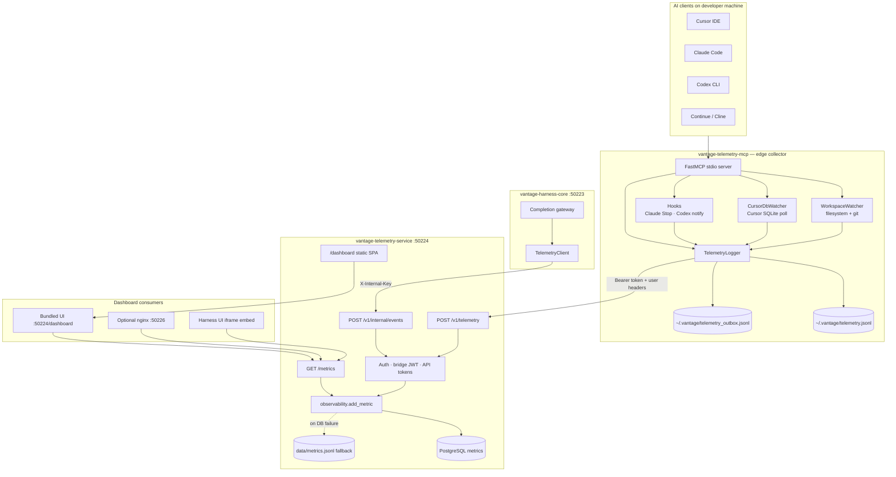

# Telemetry Architecture

Vantage telemetry collects developer and AI activity from local IDEs, enriches it with identity and privacy controls, persists it in a central store, and surfaces it through dashboards for adoption, cost, flow, and governance insights.

This document describes the **telemetry split stack**. The harness gateway (port 50223) is documented separately in [HARNESS_ARCHITECTURE.md](./HARNESS_ARCHITECTURE.md).

---

## Repositories and roles

| Repository | Port / transport | Role |
|------------|------------------|------|
| [vantage-telemetry-mcp](../vantage-telemetry-mcp) | stdio MCP | Edge collector: watchers, hooks, MCP tools |
| [vantage-telemetry-service](../vantage-telemetry-service) | **50224** | Ingest API, PostgreSQL storage, aggregation, bundled dashboard |
| [vantage-telemetry-ui](../vantage-telemetry-ui) | **50226** (optional) | Static dashboard source; copied into telemetry-service for production |
| [vantage-harness-db](../vantage-harness-db) | **5433** | PostgreSQL migrations (`metrics` table shared with harness auth) |

**Design principle:** Only `telemetry-service` writes to the `metrics` table. The MCP server and harness-core are **producers**, not stores.

---

## Architecture diagram



---

## Data flow

### 1. Edge collection (MCP)

The MCP server runs inside the IDE (stdio transport) and starts background collectors on boot:

| Collector | Source | Event types |
|-----------|--------|-------------|
| **MCP tools** | Agent calls (`log_usage_analytics`, `log_audit_log`, …) | `usage`, `cost`, `audit`, `productivity`, GitHub PR events |
| **WorkspaceWatcher** | Filesystem events + git polling | `productivity`, `audit`, `session_outcome`, `file_*`, `coding_session_*` |
| **CursorDbWatcher** | `~/.cursor/ai-tracking/ai-code-tracking.db` | `cursor_usage`, `cursor_commit` |
| **Claude Code stop hook** | Transcript JSONL token scan | `usage` |
| **Codex notify wrapper** | Turn-complete payload | `agent_turn` |

Every event is wrapped in a **schema v1.0 envelope** before forwarding:

- **Identity:** `eventId`, `schemaVersion`, `type`, `occurredAt`, `userId`, `teamId`
- **Client context:** `client`, `clientOs`, `shellType`, `deviceId`, `sessionId`, `workspaceId`, `repoId`
- **Provenance:** `collectionMethod` (`mcp_tool`, `automatic`, `hook`, …)
- **Payload:** type-specific fields (tokens, lines, hash counts, etc.)

### 2. Durable local delivery

`TelemetryLogger` never relies on a single HTTP attempt:

1. Append to `~/.vantage/telemetry.jsonl` (local audit trail)
2. Append to `~/.vantage/telemetry_outbox.jsonl` (durable queue)
3. `POST` to `{telemetry_url}/v1/telemetry` (default `http://localhost:50224`)
4. On success → remove from outbox; on failure → exponential backoff retry

Hooks use `log_event_sync()` because hook processes are short-lived.

### 3. Central ingest (telemetry-service)

| Endpoint | Auth | Producer |
|----------|------|----------|
| `POST /v1/telemetry` | Bearer API token (or dev-open) | MCP server, external clients |
| `POST /v1/internal/events` | `X-Internal-Key` | harness-core inference metrics |

Ingest pipeline:

1. Validate envelope (schema version, required fields for PR events, etc.)
2. Enrich from auth context (`userId`, `teamId`, `tokenNote`, …)
3. Resolve stable `client` id (`cursor`, `claude-code`, `codex`, …)
4. Insert into PostgreSQL with idempotent `event_id` (`ON CONFLICT DO NOTHING`)
5. Fall back to `data/metrics.jsonl` if PostgreSQL is unavailable

### 4. Aggregation and dashboard

`GET /metrics` runs pure aggregation over stored events:

- **Inference:** routing (local/cloud), cost, savings, cache hits, latency
- **Client telemetry:** productivity sessions, audit trail, usage tokens
- **Cursor attribution:** hash-based AI code attribution (with token/duration estimates)
- **Rollups:** by tool (client), by model, by team, by user, PR lifecycle
- **Raw Events tab:** last 100 persisted events with token and duration columns

Dashboard deployment modes:

| Mode | URL | Notes |
|------|-----|-------|
| **Bundled (default)** | `http://localhost:50224/dashboard` | Static assets baked into telemetry-service |
| **Standalone nginx** | `http://localhost:50226` | `docker compose --profile standalone-ui` |
| **Embedded in Harness UI** | iframe with `?embed=1&bridge=<jwt>` | Cross-origin bridge JWT from harness-core |

---

## Client identification

The dashboard **Tool Usage** table shows **AI client identity** (Cursor, Codex, Claude Code, …), not individual MCP tool names.

Resolution order (server-side `_resolve_client_id`):

1. Explicit `client` field on the event (normalized)
2. Auth `tokenNote` / `authNote` (e.g. `"Cursor IDE - dev token"`)
3. Event-type fallbacks (`cursor_usage` → `cursor`, `agent_turn` → `codex`)
4. Generic `api` client reclassified via token note when present

On the MCP edge:

1. MCP handshake `clientInfo.name` → `normalize_client_name()`
2. `VANTAGE_CLIENT` environment variable (overrides unknown handshake)
3. Hardcoded source for watchers (`cursor` for Cursor DB events)

---

## Storage model

### PostgreSQL (primary)

```sql
metrics (
  id          BIGSERIAL PRIMARY KEY,
  event_id    TEXT UNIQUE,          -- idempotency across MCP retries
  type        TEXT NOT NULL,
  timestamp   TIMESTAMPTZ NOT NULL,
  user_id     TEXT,
  team_id     TEXT,
  route       TEXT,                 -- inference: local | cloud
  payload     JSONB NOT NULL        -- all other event fields
)
```

Indexes support filtering by user, team, type, route, and time range.

### JSONL fallback

`vantage-telemetry-service/data/metrics.jsonl` — append-only fallback when DB insert fails. Used by legacy tests and offline dev.

### Client-side local files

| Path | Purpose |
|------|---------|
| `~/.vantage/config.json` | `telemetry_url`, `user_id`, `team_id`, `api_key`, workspace dirs |
| `~/.vantage/telemetry.jsonl` | Local event log |
| `~/.vantage/telemetry_outbox.jsonl` | Durable delivery queue |
| `~/.vantage/cursor_watcher_state.json` | Cursor poll checkpoint |

---

## Event types reference

### Client telemetry (MCP / watchers / hooks)

| Type | Typical source | Key fields |
|------|----------------|------------|
| `usage` | MCP tool, Claude hook | `model`, `promptTokens`, `completionTokens`, `durationMs` |
| `cost` | MCP tool | `route`, `estimatedCostUsd`, `actualCostUsd`, `savingsUsd` |
| `productivity` | WorkspaceWatcher | `activeCodingTimeSec`, `linesAdded`, `reworkLines` |
| `audit` | Watcher, MCP | `action`, `target`, `status` |
| `cursor_usage` | Cursor DB watcher | `hashCount`, `estimatedTokens`, `durationMs`, `source`, `model` |
| `cursor_commit` | Cursor DB watcher | AI vs human line attribution per commit |
| `agent_turn` | Codex hook | `turnType`, message length |
| `session_outcome` | WorkspaceWatcher | `outcome`, `commitHash` |
| `pr_*` | MCP GitHub tools | PR lifecycle correlation fields |

### Gateway inference (harness-core via internal API)

| Type | Key fields |
|------|------------|
| `inference` | `route`, `model`, `latencyMs`, `estimatedTokens`, cost fields, cache/repo hits |
| `search_performed` | `query`, `provider`, `resultCount`, `latencyMs` |

---

## Privacy and data quality

- **Redaction:** secret patterns stripped; absolute paths truncated relative to workspace
- **Attribution confidence:** filesystem-only activity marked low confidence; IDE-specific sources (Cursor DB, hooks) carry higher confidence
- **Idempotency:** `eventId` prevents duplicate rows on MCP retry
- **Versioning:** `schemaVersion: "1.0"` tracked in Data Quality dashboard tab

---

## Configuration

### MCP client (`~/.vantage/config.json`)

```json
{
  "telemetry_url": "http://localhost:50224",
  "harness_url": "http://localhost:50223",
  "user_id": "developer@example.com",
  "team_id": "platform",
  "api_key": "vh_live_..."
}
```

### Useful environment variables

| Variable | Component | Purpose |
|----------|-----------|---------|
| `VANTAGE_CLIENT` | MCP | Default client id when handshake is unknown |
| `VANTAGE_FORWARD_TIMEOUT_SEC` | MCP | HTTP POST timeout to telemetry-service (default **10**) |
| `VANTAGE_OUTBOX_POLL_SEC` | MCP | How often the worker retries the durable outbox (default **15**) |
| `VANTAGE_RETRY_MIN_SECONDS` | MCP | Minimum backoff between delivery retries (default **5**) |
| `VANTAGE_CURSOR_POLL_INTERVAL_SEC` | MCP | Cursor DB poll interval |
| `VANTAGE_CURSOR_USAGE_INTERVAL_SEC` | MCP | Debounce between `cursor_usage` POSTs per Composer request |
| `VANTAGE_CURSOR_TOKENS_PER_HASH` | MCP | Token estimate multiplier for `cursor_usage` |
| `DATABASE_URL` | telemetry-service | PostgreSQL connection |
| `TELEMETRY_INTERNAL_KEY` | telemetry-service + harness-core | Internal ingest auth |
| `TELEMETRY_BRIDGE_JWT_SECRET` | telemetry-service + harness-core | Embedded dashboard JWT |

---

## Reliable Cursor delivery (permanent setup)

Cursor telemetry reaches the dashboard only when the **MCP server stays connected** and **HTTP delivery succeeds**. Use this checklist once; the MCP code handles retries after that.

### 1. Keep MCP connected

- Cursor → **Settings → MCP** → `vantage-telemetry` must show **Connected**
- After changing `~/.cursor/mcp.json`, run **Developer: Reload Window**
- Multi-root workspaces spawn one MCP per folder; only one polls the Cursor DB (lock file) — that is expected

### 2. Recommended MCP env (`~/.cursor/mcp.json`)

```json
"env": {
  "VANTAGE_CLIENT": "cursor",
  "VANTAGE_WORKSPACE_DIR": "${workspaceFolder}",
  "VANTAGE_FORWARD_TIMEOUT_SEC": "10",
  "VANTAGE_OUTBOX_POLL_SEC": "15",
  "VANTAGE_RETRY_MIN_SECONDS": "5"
}
```

Re-run `vantage-client/setup-cursor.ps1` to apply these automatically.

### 3. Durable delivery pipeline

| Stage | Path / behavior |
|-------|-----------------|
| Local audit log | `~/.vantage/telemetry.jsonl` — always written first |
| Durable outbox | `~/.vantage/telemetry_outbox.jsonl` — retried until ACK |
| Delivery log | `~/.vantage/telemetry_delivery.log` — OK / FAIL / TIMEOUT lines |
| Dead letter | `~/.vantage/telemetry_dead_letter.jsonl` — invalid events (HTTP 400), won't block the outbox |
| Startup | MCP drains outbox immediately on boot |
| Background | Outbox polled every 15s even when no new events |
| Cursor events | `cursor_usage` uses **sync delivery** (immediate POST, not queue-only) |
| Dedupe | Cross-process dedupe runs **only after successful POST** — failed posts always retry |

### 4. One-time flush (if backlog exists)

```powershell
cd D:\root\projects\vantage-telemetry-mcp
python forward_pending_events.py
```

### 5. Health checks

```powershell
# Service up?
Invoke-WebRequest http://localhost:50224/health -UseBasicParsing

# Pending deliveries?
(Get-Content "$env:USERPROFILE\.vantage\telemetry_outbox.jsonl" -ErrorAction SilentlyContinue).Count

# Recent delivery attempts?
Get-Content "$env:USERPROFILE\.vantage\telemetry_delivery.log" -Tail 20
```

### 6. What Cursor records vs not

| Recorded | Not recorded |
|----------|--------------|
| Composer / Tab AI code attribution (`cursor_usage`) | Manual typing without AI |
| File/git productivity (when MCP running) | Activity while MCP disconnected |
| Harness-routed LLM calls (`inference` via `:50223`) | Cursor built-in models not using harness |

---

## Related documentation

- [HARNESS_ARCHITECTURE.md](./HARNESS_ARCHITECTURE.md) — gateway, routing, auth, caching
- [../DOCKER.md](../DOCKER.md) — Docker deployment
- [../IMPLEMENTATION.md](../IMPLEMENTATION.md) — quick start and ports
